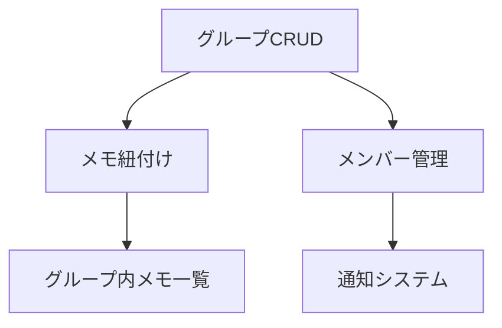
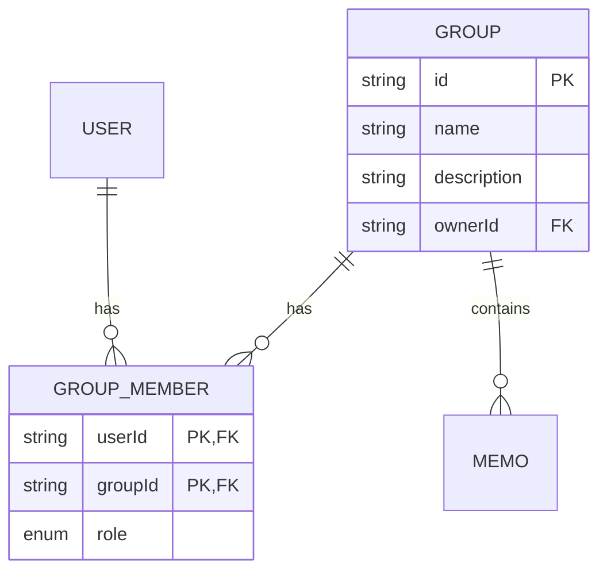

# グループ機能 仕様分析レポート

## 1. 機能要件一覧
### コア機能
- グループ作成/編集/削除
- メモのグループ紐付け
- グループ内メモ一覧表示

### メンバー管理
- メンバー招待/承認フロー
- メンバー一覧表示
- メンバー権限管理

### 拡張機能
- 通知システム
- 詳細権限管理(編集/閲覧権限)

## 2. 優先順位と依存関係

## 3. API設計
### グループ関連
| エンドポイント | メソッド | 説明 |
|---------------|---------|------|
| `/groups` | GET | グループ一覧取得 |
| `/groups` | POST | グループ作成 |
| `/groups/:id` | GET | グループ詳細取得 |
| `/groups/:id` | PATCH | グループ更新 |
| `/groups/:id` | DELETE | グループ削除 |

### メンバー管理
| エンドポイント | メソッド | 説明 |
|---------------|---------|------|
| `/groups/:id/invite` | POST | メンバー招待 |
| `/groups/join` | POST | 招待承認 |
| `/groups/:id/members` | GET | メンバー一覧 |
| `/groups/:id/members/:userId` | DELETE | メンバー削除 |

## 4. データモデル

## 5. 実装計画
### Phase 1: コア機能 (2週間)
- データモデル拡張
- グループCRUD API
- メモ紐付け機能

### Phase 2: メンバー管理 (1.5週間)
- 招待フロー実装
- 権限管理ミドルウェア

### Phase 3: 拡張機能 (1週間)
- 通知システム
- 詳細権限管理
