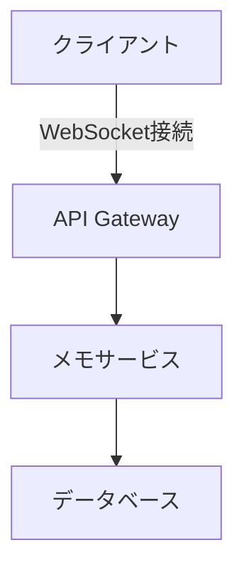

# メモアプリリアルタイム機能設計書

## 1. 技術選定

### リアルタイム通信
- **採用技術**: WebSocket
- **選定理由**:
  - 双方向通信が必要
  - 低レイテンシが要求される
  - 既存の認証フローと統合可能



## 2. データモデル拡張

```typescript
interface Memo {
  id: string;
  content: string;
  version: number; // 楽観的ロック用
  updatedAt: Date;
  history: Array<{
    content: string;
    updatedAt: Date;
    updatedBy: string;
  }>;
}
```

## 3. API設計

### WebSocketエンドポイント
- `wss://api.example.com/memos/ws`
- 接続確立後、JWT認証が必要

### REST API拡張
| メソッド | エンドポイント | 説明 |
|---------|---------------|------|
| PATCH   | /memos/{id}   | バージョンチェック付き更新 |
| GET     | /memos/{id}/history | 変更履歴取得 |

## 4. 実装計画

### Phase 1 (1-2週間)
- WebSocket基盤構築
- 基本的なリアルタイム同期

### Phase 2 (2-3週間)
- 操作履歴機能
- 競合解決UI

### Phase 3 (1週間)
- パフォーマンス最適化
